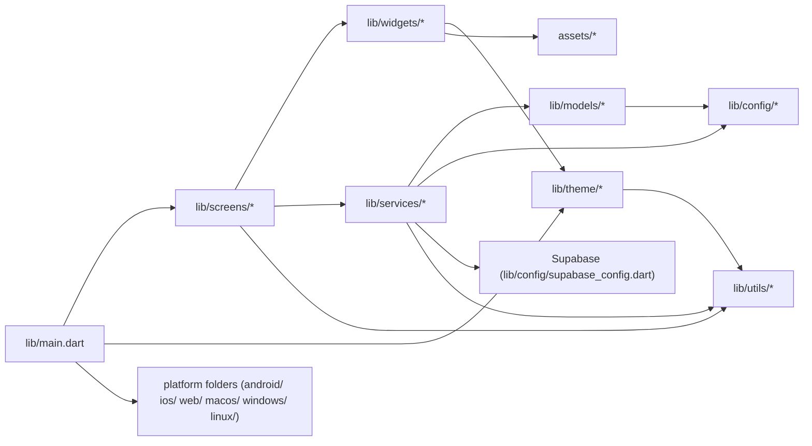

# FlowFi — Architecture and File Map

## Overview

This document describes the current architecture of the FlowFi Flutter app and lists every file under `lib/` with a short description and inferred responsibilities.

## High-level layers

- Entry: `lib/main.dart`
- Configuration: `lib/config/*`
- Domain models: `lib/models/*`
- Services / Data layer: `lib/services/*`
- Presentation: `lib/screens/*` and `lib/widgets/*`
- Theming: `lib/theme/*`
- Utilities: `lib/utils/*`

## Mermaid diagram

## File map (all `lib/` files)

### Root

- `lib/main.dart` — app entrypoint, initializes routing, theme, global services.

### Configuration (`lib/config`)

- `lib/config/constants.dart` — app-wide constants.
- `lib/config/env.dart` — environment variables / configuration loader.
- `lib/config/supabase_config.dart` — Supabase client and configuration (backend integration).

### Models (`lib/models`)

- `lib/models/user_model.dart` — User domain model.
- `lib/models/transaction_model.dart` — Transaction data model.
- `lib/models/notification_model.dart` — Notification model.
- `lib/models/contact_model.dart` — Contact model for transfers/contacts.
- `lib/models/card_model.dart` — Card model (payment/virtual card info).

### Services (`lib/services`)

- `lib/services/auth_service.dart` — Authentication, session management (likely Supabase-backed).
- `lib/services/database_service.dart` — Database operations (CRUD for models).
- `lib/services/storage_service.dart` — File uploads/downloads (assets, avatars) or Supabase storage.
- `lib/services/payment_service.dart` — Payment operations and integrations.
- `lib/services/notification_service.dart` — Push/local notification orchestration.

### Screens (`lib/screens`)

Auth screens (`lib/screens/auth`):

- `lib/screens/auth/splash_screen.dart` — Splash / loading screen.
- `lib/screens/auth/welcome_screen.dart` — Landing/welcome UI.
- `lib/screens/auth/signin_screen.dart` — Sign-in form UI.
- `lib/screens/auth/signup_screen.dart` — Sign-up form UI.
- `lib/screens/auth/otp_screen.dart` — OTP verification UI.
- `lib/screens/auth/profile_setup_screen.dart` — Initial profile setup after signup.

Onboarding screens (`lib/screens/onboarding`):

- `lib/screens/onboarding/onboarding_1.dart`
- `lib/screens/onboarding/onboarding_2.dart`
- `lib/screens/onboarding/onboarding_3.dart`

Main app screens (`lib/screens/main`):

- `lib/screens/main/dashboard_screen.dart` — Dashboard / home overview.
- `lib/screens/main/transactions_screen.dart` — Transactions list.
- `lib/screens/main/transfer_screen.dart` — Transfer flow UI (amount entry).
- `lib/screens/main/transfer_confirmation_screen.dart` — Transfer confirmation.
- `lib/screens/main/cards_screen.dart` — Card management UI.
- `lib/screens/main/profile_screen.dart` — User profile view.
- `lib/screens/main/menu_screen.dart` — App menu / navigation drawer target.
- `lib/screens/main/notifications_screen.dart` — Notifications center.

### Widgets (`lib/widgets`)

- `lib/widgets/custom_appbar.dart` — App bar used across screens.
- `lib/widgets/custom_button.dart` — Themed button component.
- `lib/widgets/custom_textfield.dart` — Themed input field.
- `lib/widgets/custom_drawer.dart` — Navigation drawer implementation.
- `lib/widgets/transaction_item.dart` — Single transaction list item.
- `lib/widgets/numpad_widget.dart` — Numeric keypad for money entry.
- `lib/widgets/loading_widget.dart` — Reusable loading indicator.
- `lib/widgets/empty_state.dart` — Empty state UI patterns.
- `lib/widgets/card_widget.dart` — Visual representation of a card.
- `lib/widgets/balance_chart.dart` — Chart showing balance history.

### Theme (`lib/theme`)

- `lib/theme/colors.dart` — Color palette definitions.
- `lib/theme/gradients.dart` — Gradient styles used in UI.
- `lib/theme/text_styles.dart` — Typography styles and text themes.
- `lib/theme/app_theme.dart` — App-level ThemeData and theme wiring.

### Utilities (`lib/utils`)

- `lib/utils/extensions.dart` — helpful extension methods on core types.
- `lib/utils/formatters.dart` — Number/date/amount formatters.
- `lib/utils/helpers.dart` — Misc helper functions.
- `lib/utils/validators.dart` — Input validation helpers.

## Notable integrations & patterns

- Supabase is configured under `lib/config/supabase_config.dart` and used by `auth_service.dart`, `database_service.dart`, and `storage_service.dart`.
- UI is organized into `screens` (pages) and `widgets` (reusable components).
- The project follows a layered pattern: Presentation (screens/widgets) → Services → Models.
- No explicit state-management package is visible in the file list; state may be managed with Provider, Riverpod, GetX, or simple setState in widgets (not inferable from file names alone).

## Next steps you might want

- Export this document as a PNG/SVG using the Mermaid diagram.
- Generate a package-level dependency map (third-party packages used in `pubspec.yaml`).
- Produce a visual graph of service-to-model dependencies.

---

Generated automatically from the repository file list on the developer machine.
